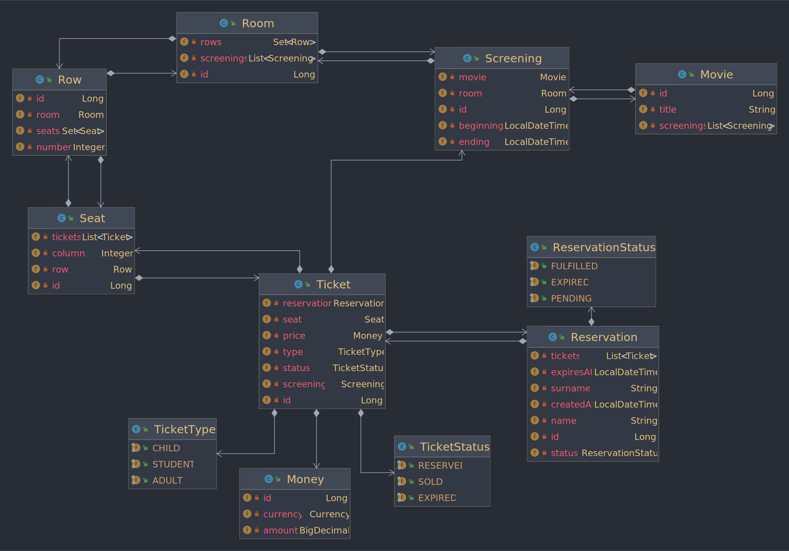

# Cinema Tickets API

A tickets reservation REST API application.

## 📖 Table of Contents

* [Features](https://github.com/mslabek/cinema-tickets-api#-features)
* [Usage](https://github.com/mslabek/cinema-tickets-api#-usage)
* [Tech stack](https://github.com/mslabek/cinema-tickets-api#-tech-stack)
* [Specification](https://github.com/mslabek/cinema-tickets-api#-specification)
* [Solutions I'm most happy with](https://github.com/mslabek/cinema-tickets-api#-solutions-im-most-happy-with)
* [Problems I've run into](https://github.com/mslabek/cinema-tickets-api#-problems-ive-run-into)
* [Specification](https://github.com/mslabek/cinema-tickets-api#-specification)
* [Additional assumptions](https://github.com/mslabek/cinema-tickets-api#-additional-assumptions)

## 🦾 Features

- REST API endpoints for displaying data, making reservations and performing payments for these reservations.
- Extensive validation of requests - upon receiving a malformed or invalid request the application will respond with
  a proper HTTP code and body informing about the validation errors and how to fix them.
- Hibernate database locking during critical write transactions that should prevent dirty reads.
- Customization of demo data through a json file.
- Scheduled expiration of expired reservations.
- Documentation - javadoc (at least some) and swagger
- Tests (at least some)

## 🎡 Usage

### Local demo requirements

1. Java 17
2. Bash (for executing the demo scripts)
3. cURL (for executing the http requests)
4. Python (for pretty printing the requests/responses from curl)

### Local demo deployment

1. Clone this repository to your local machine - `git clone https://github.com/mslabek/cinema-tickets-api`
2. Make sure your port 8080 is free - the application will fail to launch if it isn't
3. Run the demo-launch.sh file - `./demo-launch.sh`
4. Wait until the application launches and the demo data is loaded (there should be a logger message for that - it
   should take below 5 seconds unless gradle starts downloading dependencies)
5. In another terminal window / panel run `./demo-requests.sh` (the output of running this should print the
   communication between a client and the API in a happy path)

### Other local deployment usages

1. Use `curl` or a bigger http client like Postman and make your own requests.
2. Modify the [`democonfig.json`](src/main/resources/democonfig.json) file to generate your own data before running
   the app. Be careful though! It's a crude functionality, so you can end up with data inconsistencies - the
   app doesn't check if your screening begins after it ends or if the seat is free to book, so you can end up with
   multiple tickets on the same seat in the same screening. Resources are stored in the order they are added so if
   you refer to the seat with id of 3, you will refer to the third seat in the json file.
3. To check the database directly, open `localhost:8080/h2-console` and log in with following data:
    - JDBC URL: `jdbc:h2:mem:dev`
    - User Name: `sa`
    - Password: (empty)

### Potential problems

1. If demo data has not been loaded, the application was probably ran without the `spring.profiles.active=demo`
   environment variable. `launch.sh` passes this argument as an argument to gradle.
2. As above - if the port 8080 on your machine is not open during application deployment, it will throw an exception
   and turn off.

## 🛠 Tech Stack

Most important technologies / libraries used:

- **Spring Boot**:
    - Spring MVC
    - Spring Data JPA
- Build tool: **Gradle**
- Database: **H2** (I didn't see any reason to use something more complex - an embedded lightweight relational db seems
  perfect for this use case. It's especially useful for ease of local deployment - no need to build a docker container
  with a dedicated database.)
- Validation: **Hibernate Validator** (all required validation checks from the specification can be done using the
  built-in validators and I managed to create a custom annotation for validating enums)
- **Lombok** (for development speed. Especially useful for an anemic domain model)
- Testing (though frankly many important tests are missing):
    - **Mockito**
    - **AssertJ**
- Documentation tool: **Swagger**

## 🤌 Solutions I'm most happy with

1. **Validation**:
    - Besides the validation requirements from the specification I've assumed that every input from the client can
      be wrong. I tried to account for as many situations as I could have imagined and implemented validation for them.
    - I tried to validate also the data that has no chance of being fulfilled - like minimum 1 for id numbers.
    - Forms also contain enum names as Strings so that they can be validated after being mapped, because I wanted to
      create a custom exception message for these situations
2. **Exception handling**:
    - I used global exception handlers to control the response codes and messages.
    - When throwing a runtime exception, the exception handler constructs a data object containing all relevant
      information about the problem to the client and returns it in the response body.
    - When validation exception is thrown, the client gets information about all validation problems that occurred.
3. **Persistence layer performance**:
    - No eager fetching.
    - One query per request - all complex queries are manually written in JPQL.
4. **Data model**:
    - Current data model allows for extension in different directions, for example:
        - the cinema room rows can be extended to contain more information about their position in the room,
        - more movies could be easily added and their model could be easily extended.
    - Statuses of entities are stored as Strings but mapped to enums.
    - Money is stored with consideration for different currencies and calculations - the amount is stored as
      BigDecimal (with precision of 2, however if the use case was extended to include more complicated operations,
      this precision can be easily increased).
    - The diagram of the data model:
      
5. **General project structure**:
    - Even though this is done in an anemic domain model (which only after writing this app I get why is considered an
      anti-pattern...) it was pretty easy to develop new functionalities and refactor old ones.
    - Communication between layers is generally consistent:
        - Controllers talk only to the Service layer through dedicated interfaces where they only have access to dtos,
        - Services talk to the Persistence layer and to each other (only dedicated services have access to
          repositories),
        - Repositories are accessed only through interfaces and talk to no one,
    - Packages are divided first by feature, then by layer,
    - I tried to minimize and normalize the communication between packages - this can be observed on the diagram of
      the data model where:
        - from the ticket package only ticket has external dependencies,
        - from the screening package only screening has external dependencies,
        - from the cinema package room and seat have external dependencies,
    - The feature packages are following:
        - cinema, screening and ticket packages represent main entities in the data model
        - common package contains features that can be used in many packages
        - infrastructure package contains configuration
        - demo package contains classes generating data for demo purposes
6. **Easily changeable domain configuration**:
    - Even though right now most business-logic values are hard-coded, it would be very easy to modify them, for
      example:
        - adding another ticket type would require adding only a couple of lines of code, because it's an enum,
        - changing prices could be easily externalized though mechanisms built into Spring,
        - changing currencies would also be very easy (however many further modifications would be required if you
          wanted to add support for multiple currencies of course).
    - Demo data is fully externalized and can be easily modifies because the data generator bases wholely on the data
      parsed through a json file.

## 🪳 Problems I've run into

and how I solved them (or not...)

1. **Anemic domain model**:
    - I think this is the single biggest problem with this application. Before building this I didn't understand why
      some called this an anti-pattern, but now I do. The main problems this architecture caused me:
        - even though the project is structured generally consistently, it was really hard to decide what services to
          create and what are their responsibilities,
        - naming services and their functionalities is hard (CinemaService, RoomService, TicketService...) and the more
          the project grows, the more it becomes hard to understand what service does what,
        - sometimes it doesn't really feel like oop - value objects don't carry with them their functionalities so this
          creates additional dependencies between services.
    - Before I realized this causes some `spaghetti` and `lasagna` issues in the service layer, the code was about 1k
      lines long and the time was running short. Not only was this a large task, but frankly I have little to no
      experience with developing a rich domain model. I wrote this app in 5 days during Christmas, but that was
      possible only because I had some experience with anemic domains and because I neglected writing tests.
    - Ultimately, this problem was not solved - I chose consistency of already existing code over better
      architecture. If I were to spend more time on this app I would research the principles of rich domain models
      and do a large refactoring.
2. **Lack of tests and documentation**:
    - When I started building this app, I didn't notice many complexities in the domain. But even then I knew that
      proper development process is not going to help me with my self-imposed time constraints.
    - I tried to write a couple tests for different kinds of methods to showcase that I can write them and to make
      it easier in the future.
    - Even though many critical javadocs are missing, I tried to at least document the controllers in Swagger to
      make it easier to test manually.
    - Again, ultimately this was not solved, however I try to I justify my transgressions against `The powers that be`
      (that being Uncle Bob and Robert Fowler) by time constraints, willingness to read their scripture and to refactor.
3. **One weird hack**:
    - Context:
        - When creating reservations, I am loading all the relevant entities in one query.
        - For every ticket, there needs to be a seat loaded.
        - These seats along with other entities are join fetched in one query as a part of Screening object.
        - Seat has a bidirectional relation with Ticket. When creating a Ticket, I am getting the Seat
          that the ticket is for and I am calling the method for synchronizing both ends of the relationship.
        - This synchronizing method adds the Ticket to the list of tickets the Seat has.
        - The Seat normally initializes its Ticket list as a modifiable list, but here instead it's loaded with an
          immutable list of Tickets.
    - My "solution" is basically to copy the immutable list to a mutable list and replace them in the Seat object.
      Then adding the Ticket is possible.
    - I tried to research this, but was unable to understand why this problem occurs. I will try to understand it in
      the future. Also, I don't know the repercussions of this hack, so I'm not proud of it. Prayers to George Hotz
      will be said so that this hack does not break the app before I come up with a proper solution.
    - This hack is located in
      
      near the end of the buildTicket method.
4. **Multiple join fetches and filtering**
    - In order for my plan to have one JPQL query per request to work, I would have to perform multiple join fetches
      at a time. I had to remodel some parts of the domain for it to work.
    - Another problem was that JPA does not allow for filtering the join-fetched resources. I don't think that
      besides changing the persistence provider there is a graceful solution for this. I settled for filtering the
      results manually outside the database. This causes other problems, but that's the price of the compromise I guess.
    - I could have settled for multiple queries or eager fetching at limited times, but ultimately I managed to make it
      work. This required some research into the limitations of JPA and Hibernate and I'm pretty happy with the
      solutions.

## 🎯 Specification

### Ticket booking app

The goal is to build a seat reservation system for a multiplex.

#### Business scenario (use case)

1. The user selects the day and the time when he/she would like to see the movie.
2. The system lists movies available in the given time interval - title and screening
   times.
3. The user chooses a particular screening.
4. The system gives information regarding screening room and available seats.
5. The user chooses seats, and gives the name of the person doing the reservation
   (name and surname).
6. The system gives back the total amount to pay and reservation expiration time.

#### Assumptions

1. The system covers a single cinema with multiple rooms (multiplex).
2. Seats can be booked at latest 15 minutes before the screening begins.
3. Screenings given in point 2. of the scenario should be sorted by title and screening time.
4. There are three ticket types: adult (25 PLN), student (18 PLN), child (12.50 PLN).

#### Business requirements

1. The data in the system should be valid, in particular:

    - Name and surname should each be at least three characters long, starting with a capital letter. The surname could
      consist of two parts separated with a single dash, in this case the second part should also start with a capital
      letter.
    - Reservation applies to at least one seat.

2. There cannot be a single place left over in a row between two already reserved places.
3. The system should properly handle Polish characters.

#### Technical requirements

1. Application must be written in JVM language (Java, Scala, Kotlin etc.)
2. Operations must be exposed as REST services
3. No need to stick to any particular database - relational, NoSQL or in-memory database is fine
4. No need to build frontend

#### Demo

1. Include shell script that will build and run your app.
2. The system should be automatically initialized with test data (at least three screening rooms, three movies and
   two screenings per room).
3. Include shell script that would run whole use case calling respective endpoints (using e.g. curl), we want to see
   requests and responses in action.

#### Before submitting...

1. Make sure your solution contains a README file, which explains how to build and run your project and demo.
2. If there are some additional assumptions you’ve made, put them in README as well.
3. Prepare a single pull request containing whole source code (so that we can easily do a code review for you).

## ❓ Additional assumptions

1. No authentication or external payment processing mechanism is required
2. One reservation can concern tickets for seats from only one screening
3. There doesn't need to be another way to pay for the tickets that through payment for the whole reservation

